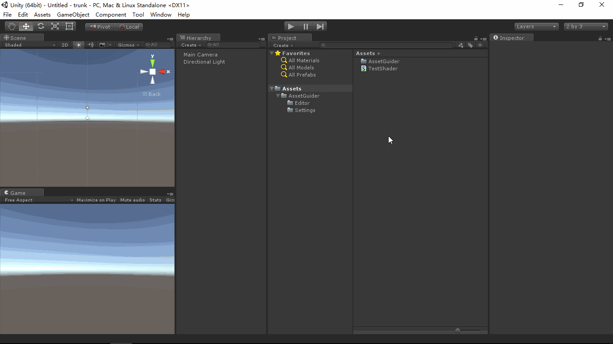

# AssetGuider
- [English Manual](./README.md)

## 概述
- Unity资源文件打开方式导向器。

## 需求
- 在Unity编辑器中，双击或者右键打开一些资源文件（例如：文本，Shader等）时，编辑器使用默认的编辑工具。
  可是有的时候，我们希望使用自定义的工具来打开/编辑这些文件，例如：使用文本编辑器打开.txt文件，使用
  Sublime Text打开.shader文件等。

## 环境
- Unity 5.0 或更高版本。
- .Net Framework 3.5 或更高版本。

## 条件
- Unity提供OnOpenAsset编辑器属性命令来拦截资源文件打开事件。

## 方案
- 用一个配置文件来记录那些我们希望使用自定义工具打开的文件的扩展名。
- 编写扩展编辑器代码，通过OnOpenAsset编辑器属性命令拦截资源文件打开事件，并从文件路径中获取到文件扩展名。
- 检查这个文件扩展名是否在配置文件中有记录，如果没有则不处理拦截，让Unity调用其默认的工具来打开文件，
  否则处理拦截，通过调用Application类的OpenURL方法，让Unity使用操作系统中对应文件类型的默认编辑工具
  来打开文件。
- 手动在操作系统中设定各类文件类型的默认打开程序，例如设定.shader文件的默认编辑器为Sublime Text，设定.fbx
  文件的默认编辑器为Maya等。

## 预览
- Asset Guider

## 联系
- 如果你有任何问题或者建议，欢迎通过mogoson@outlook.com联系我。